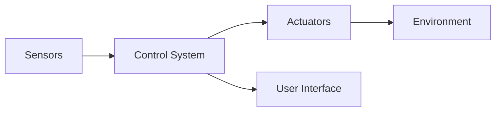

# Mufasa Robot

## Project Overview
Mufasa Robot is an advanced robotic system designed to perform various tasks autonomously. It leverages cutting-edge technologies to interact with its environment, making it suitable for a range of applications from home automation to industrial processes. This project aims to provide a flexible and scalable robot that can be customized for different use cases.

## Tech Stack
- **Programming Languages**: Python, C++
- **Frameworks & Libraries**:
  - Robot Operating System (ROS)
  - OpenCV for image processing
  - TensorFlow for machine learning
- **Databases**: SQLite for storing configuration and logs
- **Tools**: Git for version control, Docker for containerization

## Architecture
The architecture of Mufasa Robot consists of the following components:
- **Sensors**: Various sensors for detecting obstacles, measuring distance, and capturing data.
- **Actuators**: Motors and servos that provide movement and control.
- **Control System**: Centralized processing unit that coordinates sensors and actuators, implements algorithms, and executes commands.

```


## Installation Instructions
1. **Clone the Repository**:
   ```bash
   git clone https://github.com/Ekisa02/Mufasa-Robot.git
   cd Mufasa-Robot
   ```

2. **Install Dependencies**:
   Ensure you have Python and pip installed, then run:
   ```bash
   pip install -r requirements.txt
   ```

3. **Set Up ROS**:
   Follow the instructions provided in the [ROS installation documentation](http://wiki.ros.org/ROS/Installation).

4. **Launch the Robot**:
   Start the Mufasa Robot using ROS launch files:
   ```bash
   roslaunch mufasa_robot.launch
   ```

## Design System Documentation
The design system for Mufasa Robot is based on modular design principles, allowing components to be added or removed as necessary. It follows best practices in software development, ensuring code is maintainable, scalable, and reusable. Documentation for the design system, including component specifications and design patterns, can be found in the `docs` directory of the repository.

### Contributions
We welcome contributions to improve Mufasa Robot. Please submit a pull request or open an issue if you have suggestions or improvements.
